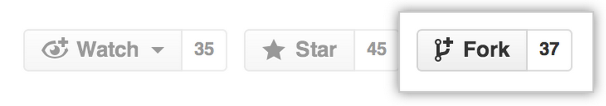
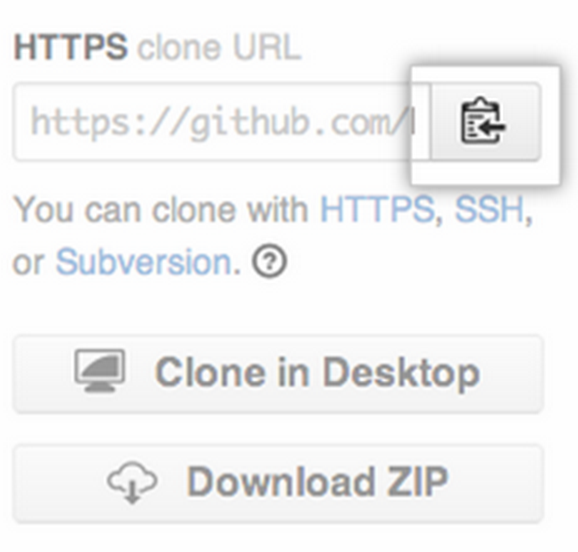

#Intro to Git and Github Pages

#SWBAT Understand After the Lesson:
+ Basic git workflow
+ git init
+ git add
+ git commit
+ setting remotes
+ git push
+ Github pages
+ Fork and Clone

#Motivation:
Github is like facebook for developers. Developers created tools for source and version control - programs to help them manage the history of files and help share across teams. Much of the open source community rallied around one such tool, git, and you have heard of and now seen and created a profile on the Github, which hosts repositories for open source code.
We're going to learn how to use git and Github to manage our files and share them publicly. We'll also use a Github feature called Pages to publish our first site for the world to see!
Note: Students will have already created an account on Github, so they will have non-zero familiarity with Github. Some might have done a tutorial, but Git is hard, so they can use the practice anyway.

#Git Overview
Git makes sharing code and collaborating on software projects easier possible. For now, we are going to practice one-player git, so that you get a sense of the workflow and get some familiarity with the basic commands.

The workflow goes:
+Git init- Start a repository (home for the project files -  underneath, it's a directory plus extra info)
+Make Changes
+Git add-Add changed files to staging area
+Git commit-Commit changes
+Git push-Push changes to a remote repository

All that might sound like gibberish now, but once we try it out, it'll start to make more sense.

#Initializing a git repository

Open Terminal. Navigate into the directory where you were making your bio page, and initialize a git repository. Like this:

```
$ cd desktop
$ cd my-profile-project
$ git init
Initialized empty Git repository in
/Users/username/dev/my-profile/.git/
```

Congratulations! You made your first repository!

#Make Changes and Add
Make a change to your profile page. It can be a small one. Save the file.
To add that file to the staging area:
```
 git add my_profile.html
or
 git add .
```
Using the '.' adds all the files in your current directory (remember, '.' is an alias for the working directory)

Adding files to the staging area sets up your save point. Which changes do you want to commit to the history? While files are in the staging area, it's easy to edit what changes you are going to save to the history - you can adjust them so they are just how you want them to be remembered.

#Commit
git commit -m "first commit"

The -m flag lets you add a message to your commit. Be as specific with your messages as possible because they are reminders of the changes you made to the files that you wanted to save and share.

Now that you've committed, you've got that snapshot saved on your computer - if you need to go back to that point later, or you are interested in the history of your project, you can see it.

Next, let's push those committed changes to Github!

#Setting Remotes and Pushing
We want to keep our project somewhere where it is safe.

In Chrome, log in to the Github website. On Github, click to create a new repository. Name it something descriptive and meaningful. Don't initialize it with a Readme. When you click create, Github will take you to a page that has some instructions. You've already done part of them - initialized a repository, created, added, and committed a file. The parts you need now are
```
$ git remote add origin http://github.com/<username>/<name-of-repository>.git
$ git push -u origin master
```
which will prompt you for your github username and password. Provide them!

The `remote add` command tells github that you want to link your local repository to a new remote repository at that url

Next, the `push` command sends the files to the 'master' branch of the 'origin' repository.

#Github pages
Let's get a page online for the world to see!
Github, which is so cool for storing our files and the history of our commits, also has an awesome Pages feature, which lets us publish simple websites for free, all from the command line.

Here's an example github page with instruction to create your own!
<a href= "http://google-cssi.github.io/sample-pages/">Example github page</a>

+ Initialize a repository
+ Set your remote to a repository on github
+ Add some changes, commit them, and push them up to the remote master branch
+ Checkout a branch named gh-pages
+ Push to a remote branch named gh-pages
+ Go check out your site!

You have already finished steps 1-3. Just three more steps to publish a site to the world!
Follow the directions above to create a github pages for your profile page project!

#Git Fork and Git Clone for Labs

Each day you will have labs for each lesson. To work on the lab your will fork the lab to copy it onto your github account. Then you will clone it onto your local machine (your computer).

We want our own version each lab called. To make our own version, we'll fork the original - that will give us a copy to modify.

Fork the repository
To fork the github repository, click the Fork button.


Sit back and watch the forking magic. When it’s finished, you’ll be taken to your copy of the  repository in your github account.

Clone your fork
You’ve successfully forked the repository, but so far, the files only exist on GitHub. To be able to work on the project, you will need to get the files onto your computer. Here's how to clone it to a directory on your local machine.



In the right sidebar of the repository page on Github, click to copy the URL for the repository. The url should be something like: ```https://github.com/YOUR-USERNAME/LAB-REPOSITORY.git```

In Terminal, navigate to the directory where you want the files. (Use cd!)
git clone, and paste the URL you copied, and hit enter.
```git clone https://github.com/YOUR-USERNAME/LAB-REPOSITORY.git```
